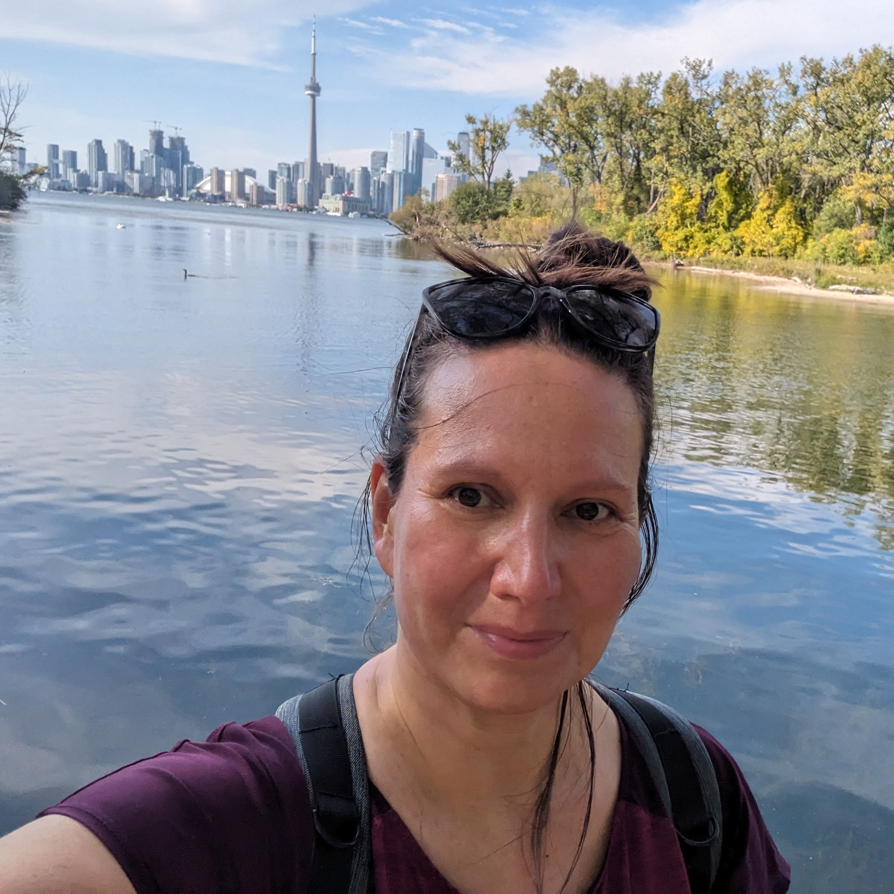
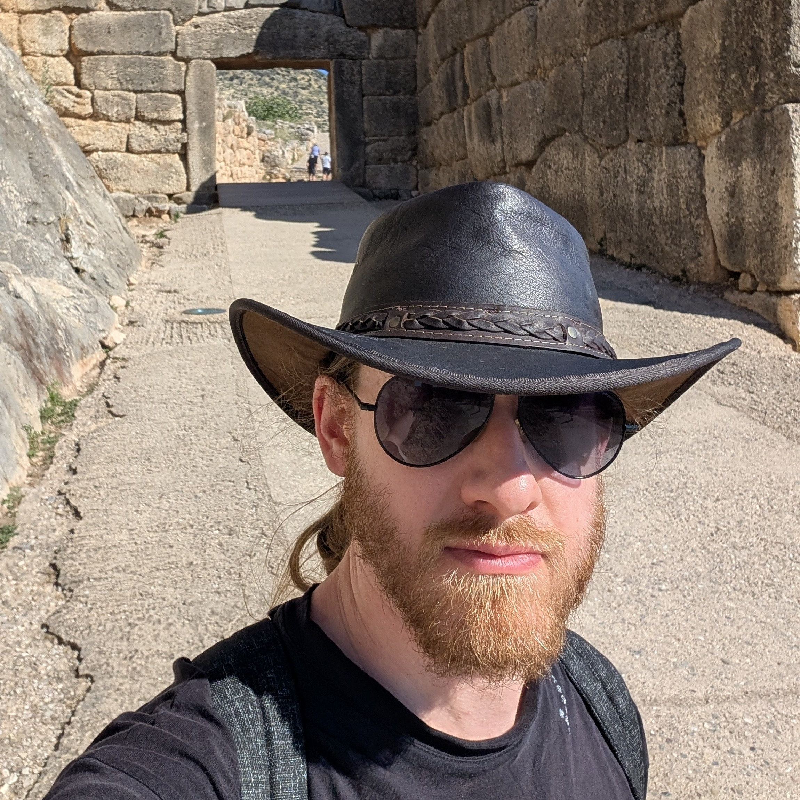
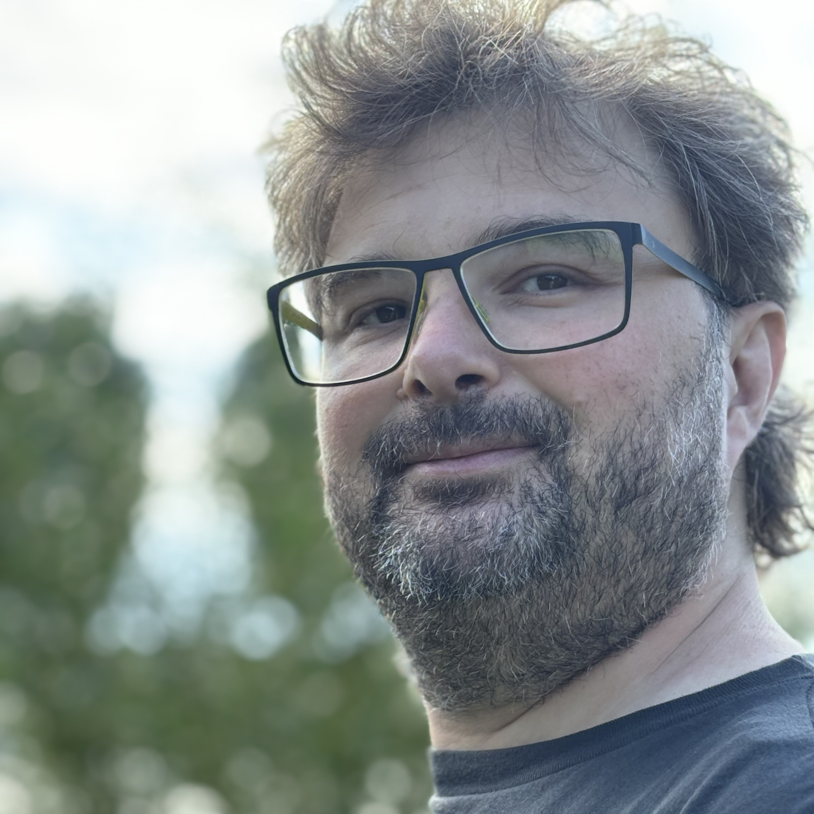
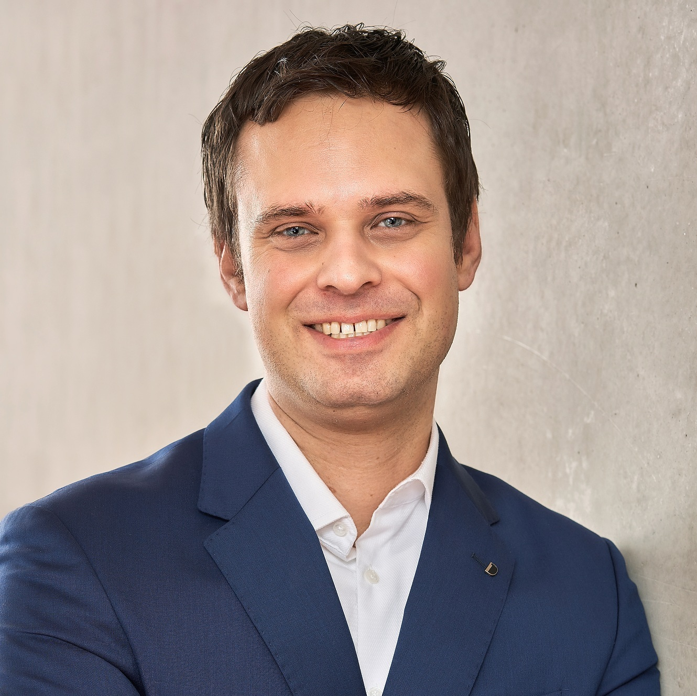

+++

title = "ACSOS 2026 - Opening Ceremony"
description = "Acsos 2026 Opening"
outputs = ["Reveal"]

+++



# Welcome to Cesena

---



  <h1 style="margin:0 0 .15em; font-size:1.9em; letter-spacing:.04em;">Two streams. One community.</h1>
  

    

    
➜

    
➜

    

      
ICAC

      

        
<b>2004</b> · New York, NY, USA

<b>2005</b> · Seattle, WA, USA

<b>2006</b> · Dublin, Ireland

<b>2007</b> · Jacksonville, FL, USA

<b>2008</b> · Chicago, IL, USA

<b>2009</b> · Barcelona, Spain

<b>2010</b> · Washington, DC, USA

<b>2011</b> · Karlsruhe, Germany

<b>2012</b> · San Jose, CA, USA

<b>2013</b> · San Jose, CA, USA

<b>2014</b> · Philadelphia, PA, USA

<b>2015</b> · Grenoble, France

<b>2016</b> · Würzburg, Germany

<b>2017</b> · Columbus, Ohio, USA

<b>2018</b> · Trento, Italy

<b>2019</b> · Umeå, Sweden

      

    

    

      
ACSOS

      
Autonomic Computing &amp; Self-Organizing Systems

      

        
<b>2020</b> · <s>Washington D.C.</s> · Virtual

        
<b>2021</b> · <s>Washington D.C.</s> · Virtual

        
<b>2022</b> · Virtual

        
<b>2023</b> · Toronto, Canada

        
<b>2024</b> · Aarhus, Denmark

        
<b>2025</b> · Tokyo, Japan

        
<b>2026</b> · Cesena, Italy

      

    

    

      
SASO

      

        
<b>2007</b> · Boston, MA, USA

<b>2008</b> · Venice, Italy

<b>2009</b> · San Francisco, CA, USA

<b>2010</b> · Budapest, Hungary

<b>2011</b> · Ann Arbor, MI, USA

<b>2012</b> · Lyon, France

<b>2013</b> · Philadelphia, PA, USA

<b>2014</b> · London, UK

<b>2015</b> · Cambridge, MA, USA

<b>2016</b> · Augsburg, Germany

<b>2017</b> · Tucson, AZ, USA

<b>2018</b> · Trento, Italy

<b>2019</b> · Umeå, Sweden

      

    

  

---



  
  
  
  

# ACSOS in Cesena

* A campus of the **University of Bologna** in *Romagna*
* Hosts about one third of the **Department of Computer Science and Engineering**
* Home of several ACSOS/SASO contributors
* Recent and modern infrastructure
* Cesena hosted a hybrid *IEEE ACSOS special event* in 2022
    * three speakers
    * rich social program

---



# Moving in the Campus, floor 1

---



# Moving in the Campus, floor 0

---



# Finding electricity plugs

* Plugs are located every five seats or so, look at the bottom-right of your seat
    * Plugs are Italian "Bipasso", also compatible with German plugs

---



# Malatestiana Library Visit

### *Wednesday*, **18:00** (turn 1) and **19:00** (turn 2)

* Malatestiana Library visits are **limited**!
* We secured *50* places, allocated to the first 50 people who registered *and* expressed interest
    * If you are among the lucky ones, you'll find a **ticket in your badge**
    * The *first 25* registrants have been allocated to *turn 1*, the **other 25** to **turn 2**
* Tickets are *not nominal*:
    * You can *swap* tickets with someone else
    * You can *give away* your ticket
    * If you change your mind and no longer wish to visit the Malatestiana, please consider giving away your ticket!

---



# Conference dinner and award ceremony

### *Wednesday*, **19:00** to **02:00**

  
  

* Teatro Verdi, Cesena
    * In the city center, a *half-hour* walk from the Campus
* **Aperitivo** starts at 19:00
* The **three-course dinner** will be served afterwards
    * *Around* 20:20
    * we will allow enough time for those visiting the Malatestiana Library to join
* After dinner, the stage will become a **dance floor**
    * Open bar available

---



# Reaching Teatro Verdi

 
    <iframe src="https://www.google.com/maps/embed?pb=!1m28!1m12!1m3!1d11229.017523034237!2d12.23174566336883!3d44.141620135874646!2m3!1f0!2f0!3f0!3m2!1i1024!2i768!4f13.1!4m13!3e2!4m5!1s0x132ca5001772debd%3A0x793506a75e8e1a42!2sUniversit%C3%A0%20di%20Bologna%20-%20Campus%20di%20Cesena%2C%2047521%20Cesena%20FC%2C%20Italia!3m2!1d44.1478167!2d12.235488799999999!4m5!1s0x132ca4c9fa8d80c3%3A0xfd0d08ff05861f90!2sTeatro%20Verdi%2C%20Via%20Luigi%20Sostegni%2C%2013%2C%2047521%20Cesena%20FC%2C%20Italia!3m2!1d44.135393699999995!2d12.2485599!5e1!3m2!1ses-419!2sco!4v1783950745972!5m2!1ses-419!2sco" width="1500" height="900" style="border:0;" allowfullscreen="" loading="lazy" referrerpolicy="strict-origin-when-cross-origin"></iframe>

 

---



# Additional Social events

  

{}
{}
* *Today*: **Wine**, Views, and Dinner on Romagna’s Balcony
    * Wine tasting and dinner in Bertinoro
    * A bus will pick up participants right from the campus at the end of the last session
{}
{}
* *Thursday*: **ACSOS GP** on the Riviera: Racing & Dinner
    * Kart racing in Riccione
    * Non-racing Riccione walk option
    * Dinner in Rimini at Bounty
{}
{}
* *Friday*: Along Leonardo’s Canal: **Cesenatico** and Fish Dinner
    * Visit to the maritime museum
    * Visit to Leonardo's Canal and Cesenatico city center
    * Fish dinner near the beach
        * Meat and veggy options avail.
{}
{}

  

    <b>Register at:</b> 
    serinarpayments.it/acsos-2026/
  

  

    
  

---



# ACSOS 2026 Social Coordination via Telegram

  

    
    
https://t.me/+u-8V_NYXBpo1MWY0

  

  

    

      
    

  

---



# Pics, or didn't happen

  

    
    
https://photos.app.goo.gl/S2NSXuZUPYkGQfLo6

  

  

    

      
    

  

---



# Program at a glance

    <table class="program">
        <colgroup>
            <col style="width:8%">
            <col style="width:18.4%">
            <col style="width:18.4%">
            <col style="width:18.4%">
            <col style="width:18.4%">
            <col style="width:18.4%">
        </colgroup>
        <thead>
            <tr>
            <th></th>
            <th>Monday7 September</th>
            <th>Tuesday8 September</th>
            <th>Wednesday9 September</th>
            <th>Thursday10 September</th>
            <th>Friday11 September</th>
            </tr>
        </thead>
        <tbody>
            <tr>
                <td class="time">09:00–09:30</td>
                <td class="event main">Registration</td>
                <td class="event main">OpeningAula Magna</td>
                <td class="event keynote" rowspan="2">KeynoteMarco DorigoAula Magna</td>
                <td class="event keynote" rowspan="2">KeynoteIvona BrandicAula Magna</td>
                <td class="event workshop" rowspan="4">WorkshopsAICR-ACS · SISSYAICR-ACS: 2.3 · SISSY: 2.4</td>
            </tr>
            <tr>
                <td class="time">09:30–10:00</td>
                <td class="event workshop" rowspan="3">WorkshopsSaSSO4 · AI4ASSaSSO4: 2.10 · AI4AS: 2.4</td>
                <td class="event keynote">KeynoteValeria CardelliniAula Magna</td>
            </tr>
            <tr>
                <td class="time">10:00–10:30</td>
                <td class="event main" rowspan="2">Main-track sessionAula Magna</td>
                <td class="event main" rowspan="2">Main-track sessionAula Magna</td>
                <td class="event main" rowspan="2">Main-track sessionAula Magna</td>
            </tr>
            <tr>
                <td class="time">10:30–11:00</td>
            </tr>
            <tr>
                <td class="time">11:00–11:30</td>
                <td class="event break">Coffee break2.13</td>
                <td class="event break">Coffee break2.13</td>
                <td class="event break">Coffee break2.13</td>
                <td class="event break">Coffee break2.13</td>
                <td class="event break">Coffee break2.13</td>
            </tr>
            <tr>
                <td class="time">11:30–12:00</td>
                <td class="event workshop" rowspan="3">WorkshopsSaSSO4 · AI4ASSaSSO4: 2.10 · AI4AS: 2.4</td>
                <td class="event main" rowspan="3">Main-track sessionAula Magna</td>
                <td class="event main" rowspan="3">Main-track sessionAula Magna</td>
                <td class="event main" rowspan="3">Main-track sessionAula Magna</td>
                <td class="event workshop" rowspan="3">WorkshopsAICR-ACS · SISSYAICR-ACS: 2.3 · SISSY: 2.4</td>
            </tr>
            <tr>
                <td class="time">12:00–12:30</td>
            </tr>
            <tr>
                <td class="time">12:30–13:00</td>
            </tr>
            <tr>
                <td class="time">13:00–13:30</td>
                <td class="event break" rowspan="2">LunchSala Polivalente</td>
                <td class="event break" rowspan="2">LunchSala Polivalente</td>
                <td class="event poster-break" rowspan="2">Lunch &amp; PostersLunch: Sala Polivalente · Posters: 2.3</td>
                <td class="event poster-break" rowspan="2">Lunch &amp; PostersLunch: Sala Polivalente · Posters: 2.3</td>
                <td class="event break" rowspan="2">LunchSala Polivalente</td>
            </tr>
            <tr>
                <td class="time">13:30–14:00</td>
            </tr>
            <tr>
                <td class="time">14:00–14:30</td>
                <td class="event tutorial" rowspan="3">Tutorials 1 &amp; 2SaSSO4 also runningT1: 2.3 · T2: 2.4 · SaSSO4: 2.10</td>
                <td class="event keynote" rowspan="2">KeynoteCarlo GhezziAula Magna</td>
                <td class="event main" rowspan="4">Main-track sessionAula Magna</td>
                <td class="event main" rowspan="4">Main-track sessionAula Magna</td>
                <td class="event workshop" rowspan="3">WorkshopsAICR-ACS · SISSYAICR-ACS: 2.3 · SISSY: 2.4</td>
            </tr>
            <tr>
                <td class="time">14:30–15:00</td>
            </tr>
            <tr>
                <td class="time">15:00–15:30</td>
                <td class="event phd">PhD flash talksAula Magna</td>
            </tr>
            <tr>
                <td class="time">15:30–16:00</td>
                <td class="event break">Coffee break2.13</td>
                <td class="event poster">Poster flash talksAula Magna</td>
                <td class="event break">Coffee break2.13</td>
            </tr>
            <tr>
                <td class="time">16:00–16:30</td>
                <td class="event tutorial" rowspan="3">Tutorials 3 &amp; 4SaSSO4 also runningT3: 2.3 · T4: 2.4 · SaSSO4: 2.10</td>
                <td class="event poster-break">Coffee break &amp; PostersCoffee: 2.13 · Posters: 2.3</td>
                <td class="event poster-break">Coffee break &amp; PostersCoffee: 2.13 · Posters: 2.3</td>
                <td class="event poster-break">Coffee break &amp; PostersCoffee: 2.13 · Posters: 2.3</td>
                <td class="event workshop" rowspan="4">WorkshopsAICR-ACS · SISSYAICR-ACS: 2.3 · SISSY: 2.4</td>
            </tr>
            <tr>
                <td class="time">16:30–17:00</td>
                <td class="event main" rowspan="3">Main-track sessionAula Magna</td>
                <td class="event panel" rowspan="2">ACSOS in Practice / Doctoral Symposium breakoutsIn Practice: Aula Magna · DS: 2.3 / 2.4</td>
                <td class="event panel" rowspan="2">Expert Panel / Doctoral Symposium breakoutsPanel: Aula Magna · DS: 2.3 / 2.4</td>
            </tr>
            <tr>
                <td class="time">17:00–17:30</td>
            </tr>
            <tr>
                <td class="time">17:30–18:00</td>
                <td class="event blank">—</td>
                <td class="event special">Malatestiana library visitBiblioteca Malatestiana</td>
                <td class="event main">ClosingAula Magna</td>
            </tr>
            <tr class="evening">
                <td class="time">Evening</td>
                <td class="event social"><a href="https://2026.acsos.org/attending/welcome-reception">Welcome Reception</a>Rocca Malatestiana</td>
                <td class="event social"><a href="https://2026.acsos.org/attending/social-events">Additional SE: Wine Tasting &amp; Dinner in Bertinoro</a>Bertinoro · off-site</td>
                <td class="event social"><a href="https://2026.acsos.org/attending/main-social-event">Banquet at Teatro Verdi</a>Teatro Verdi</td>
                <td class="event social"><a href="https://2026.acsos.org/attending/social-events">Additional SE: Kart Race in Riccione &amp; Dinner in Rimini</a>Riccione / Rimini · off-site</td>
                <td class="event social"><a href="https://2026.acsos.org/attending/social-events">Additional SE: Visit to Cesenatico &amp; Fish Dinner on the beach</a>Cesenatico · off-site</td>
            </tr>
        </tbody>
    </table>

  Keynote
  Main track
  Workshop
  Tutorial
  Doctoral Symposium
  Posters / demos
  Posters + break / lunch
  Panel / in-practice
  Special event
  Break / lunch

---



# Keynote speakers

  

    
Tuesday · 09:10–10:00 main track keynote

    
    <h3 style="margin:.35em 0 .1em; font-size:1.15em;">Valeria Cardellini</h3>
    
Tor Vergata University of Rome

    
<b>Adaptive Serverless Computing Across the Cloud-Edge Continuum</b>

  

  

    
Wednesday · 09:00–10:00 main track keynote

    
    <h3 style="margin:.35em 0 .1em; font-size:1.15em;">Marco Dorigo</h3>
    
Université Libre de Bruxelles

    
<b>Bridging Centralized and Decentralized Control in Robot Swarms through Self-Organizing Hierarchies</b>

  

  

    
Thursday · 09:00–10:00 main track keynote

    
    <h3 style="margin:.35em 0 .1em; font-size:1.15em;">Ivona Brandic</h3>
    
TU Wien

    
<b>Bridging Classical and Quantum Computing: Lessons, Challenges, and Opportunities</b>

  

  

    
Tuesday · 14:00–15:00 doctoral symposium keynote

    
    <h3 style="margin:.35em 0 .1em; font-size:1.15em;">Carlo Ghezzi</h3>
    
Politecnico di Milano

    
<b>Being a researcher — in turbulent times</b>

  

---



# Thank you, Organizing committee!

  
 <b>Aishwaryaprajna</b> <small>Workshop Co-Chair</small>

  
 <b>Elsy Kaddoum</b> <small>Workshop Co-Chair</small>

  
 <b>Mirko D'Angelo</b> <small>Registration Chair</small>

  
 <b>Ilias Gerostathopoulos</b> <small>Tutorial Chair</small>

  
 <b>Gabriele Russo Russo</b> <small>Tutorial Chair</small>

  
 <b>Roberto Casadei</b> <small>Finance Chair</small>

  
 <b>David King</b> <small>Sponsorship Chair</small>

  
 <b>Sven Tomforde</b> <small>Sponsorship Chair</small>

  
 <b>Kirstie Bellman</b> <small>Community Building</small>

  
 <b>Elia Henrichs</b> <small>Community Building</small>

  
 <b>Jenna Kline</b> <small>Community Building</small>

  
 <b>Lukas Esterle</b> <small>PhD Symposium Chair</small>

  
 <b>Fatemeh Golpayegani</b> <small>PhD Symposium Chair</small>

  
 <b>Jialong Li</b> <small>Proceedings Chair</small>

  
 <b>Antonio Bucchiarone</b> <small>Publicity Co-Chair</small>

  
 <b>Angela Cortecchia</b> <small>Publicity Chair</small>

  
 <b>Davide Domini</b> <small>Social Experience Chair</small>

  
 <b>Nathan Lloyd</b> <small>Publicity Chair</small>

  
 <b>Markus Stumptner</b> <small>Publicity Co-Chair</small>

  
 <b>Gianluca Aguzzi</b> <small>Web Chair and AI Chair</small>

  
 <b>Juan C. Rosero</b> <small>Web Chair</small>

  
 <b>Alessandro V. Papadopoulos</b> <small>In Practice Chair</small>

  
 <b>Ana Petrovska</b> <small>In Practice Chair</small>

  
 <b>Nicolás Cardozo</b> <small>Artifact Evaluation</small>

  
 <b>Evangelos Pournaras</b> <small>Artifact Evaluation</small>

  
 <b>Simon Dobson</b> <small>Expert Panel Chair</small>

  
 <b>Mirgita Frasheri</b> <small>Expert Panel Chair</small>

  
 <b>Martina Baiardi</b> <small>Student Volunteers</small>

  
 <b>Sona Ghahremani</b> <small>Student Volunteers</small>

  
 <b>Ghassan Al-Falouji</b> <small>Demo &amp; Poster Chair</small>

  
 <b>Nasim Beigi-Mohammadi</b> <small>Demo &amp; Poster Co-Chair</small>

  
 <b>Marco Edoardo Santimaria</b> <small>AI Chair</small>

---

# Thank you, volunteers!

(placeholder for their picture)

---



# General and PC Chairs



 
Ivana Dusparic 
Trinity College Dublin, Ireland


 
Danilo Pianini 
University of Bologna, Italy





 
Robert René Maria Birke 
University of Turin, Italy


 
Christian Krupizer 
University of Hohenheim, Germany



---



# Robert René Maria Birke, 1980-2026







<h2>Robert passed away on August 18, few days before the conference.</h2>

<h3>Robert was a beloved member of our community and a dedicated researcher. His passing is a great loss to all of us.</h3>

<h2>Today at 13:30, those willing to remember him are invited to join us in Aula Magna (where we are now).</h2>




---



# ACSOS 2026: Numbers


{}

### Conference

* **4** workshops
* **4** tutorials
* **3** keynotes
* **1** PhD symposium keynote
* **2** posters (+**8** from main-track papers)
* **6** artifacts (+**6** from main-track papers)
* **109** Registered participants
    * including keynote speakers and volunteers

{}
{}

### Main track

* **106** Abstract submissions
* **100** Complete submissions
* **20** Desk rejects (non-anonymous, AI-gen)
* **16** Accepted papers (A.R. 16%)
* **7** Conditional accepts, 100% success rate
* **23** Full papers in toal (A.R. **23%**)
* **10** Short papers 
* **5** Vision papers
* **38** Main-track presentations

{}


---



# Authors per submission


{
  "type": "bar",
  "indexAxis": "y",
  "data": {
    "labels": ["1", "2", "3", "4", "5", "6", "7", "8", "9", "11", "21"],
    "datasets": [{
      "label": "Submissions",
      "data": [23, 19, 26, 16, 9, 5, 1, 3, 2, 1, 1],
      "backgroundColor": "rgba(246,211,101,.68)",
      "borderColor": "#000000",
      "borderWidth": 1,
      "borderRadius": 5
    }]
  },
  "options": {
    "responsive": true,
    "maintainAspectRatio": false,
    "font": { "family": "Audiowide" },
    "plugins": {
      "legend": { "display": false },
      "datalabels": { "color": "#e6f5ff", "anchor": "end", "align": "top", "textAlign": "center", "offset": 8, "font": { "family": "Audiowide", "size": 48, "weight": "bold" } }
    },
    "scales": {
      "x": { "beginAtZero": true, "title": { "display": true, "text": "Author count", "color": "#e6f5ff", "font": { "family": "Audiowide", "size": 54, "weight": "bold" } }, "ticks": { "color": "#e6f5ff", "font": { "family": "Audiowide", "size": 48, "weight": "bold" }, "stepSize": 5 }, "grid": { "display": false }, "border": { "color": "#000000", "width": 4 } },
      "y": { "title": { "display": true, "text": "Number of papers", "color": "#e6f5ff", "font": { "family": "Audiowide", "size": 54, "weight": "bold" } }, "ticks": { "display": false }, "grid": { "display": false }, "border": { "color": "#000000", "width": 4 } }
    }
  }
}


106 submissions &nbsp;·&nbsp; mean: 3.4 authors

---



# What we work on

  <canvas id="acsos-keyphrase-wordcloud"></canvas>

keyphrases weighted by occurrence in submissions · top terms shown · data from easychair

---



# Submitting authors by country, map

  <svg id="acsos-authors-map" viewBox="0 0 1200 600" role="img" aria-label="World map showing countries represented by ACSOS submitting authors" style="display:block; width:100%; height:24em;"></svg>

Flags mark the 26 countries represented among ACSOS submitting authors

---



# Submitting authors by continent


{
  "type": "bar",
  "indexAxis": "y",
  "data": {
    "labels": ["Europe", "North America", "South America", "Asia", "Oceania"],
    "datasets": [{
      "label": "Authors",
      "data": [223, 41, 26, 17, 1],
      "backgroundColor": "rgba(246,211,101,.68)",
      "borderColor": "#000000",
      "borderWidth": 1,
      "borderRadius": 5
    }]
  },
  "options": {
    "responsive": true,
    "maintainAspectRatio": false,
    "font": { "family": "Audiowide" },
    "plugins": {
      "legend": { "display": false },
      "datalabels": { "color": "#e6f5ff", "anchor": "end", "align": "top", "textAlign": "center", "offset": 5, "font": { "family": "Audiowide", "size": 42 } }
    },
    "scales": {
      "x": { "beginAtZero": true, "max": 100, "title": { "display": true, "text": "Continent", "color": "#e6f5ff", "font": { "family": "Audiowide", "size": 48, "weight": "bold" } }, "ticks": { "color": "#e6f5ff", "font": { "size": 35 }, "stepSize": 10, "max": 100 }, "grid": { "display": false }, "border": { "color": "#000000", "width": 4 } },
      "y": { "title": { "display": true, "text": "Author count", "color": "#e6f5ff", "font": { "family": "Audiowide", "size": 48, "weight": "bold" } }, "ticks": { "color": "#e6f5ff", "font": { "size": 30 }, "autoSkip": true }, "grid": { "display": false }, "border": { "color": "#000000", "width": 4 } }
    }
  }
}


308 country-attributed authors · Turkey counted with Asia

---



# Submitting authors by country


{
  "type": "bar",
  "indexAxis": "y",
  "data": {
    "labels": ["Germany", "Italy", "United States", "Austria", "Brazil", "United Kingdom", "Canada", "France", "Sweden", "Denmark", "India", "Ireland", "Switzerland", "Greece", "Serbia", "Belgium", "Colombia", "Japan", "Norway", "Spain", "Israel", "Singapore", "Turkey", "Australia", "China", "Jordan"],
    "datasets": [{
      "label": "Submitting authors",
      "data": [78, 45, 28, 24, 23, 21, 13, 9, 9, 7, 6, 6, 6, 5, 4, 3, 3, 3, 3, 3, 2, 2, 2, 1, 1, 1],
      "backgroundColor": "rgba(246,211,101,.68)",
      "borderColor": "#000000",
      "borderWidth": 1,
      "borderRadius": 5
    }]
  },
  "options": {
    "responsive": true,
    "maintainAspectRatio": false,
    "font": { "family": "Audiowide" },
    "plugins": {
      "legend": { "display": false },
      "datalabels": { "color": "#e6f5ff", "anchor": "end", "align": "top", "textAlign": "center", "offset": 5, "font": { "family": "Audiowide", "size": 27 } }
    },
    "scales": {
      "x": { "beginAtZero": true, "max": 100, "title": { "display": false, "text": "Country", "color": "#e6f5ff", "font": { "family": "Audiowide", "size": 42, "weight": "bold" } }, "ticks": { "color": "#e6f5ff", "font": { "size": 35 }, "stepSize": 10, "max": 100 }, "grid": { "display": false }, "border": { "color": "#000000", "width": 4 } },
      "y": { "title": { "display": true, "text": "Author count", "color": "#e6f5ff", "font": { "family": "Audiowide", "size": 42, "weight": "bold" } }, "ticks": { "color": "#e6f5ff", "font": { "size": 30 }, "autoSkip": true }, "grid": { "display": false }, "border": { "color": "#000000", "width": 4 } }
    }
  }
}


359 submitting authors across 26 countries

---



# Accepted authors by country

  <svg id="acsos-accepted-authors-map" viewBox="0 0 1200 600" role="img" aria-label="World map showing countries represented by estimated ACSOS accepted authors" style="display:block; width:100%; height:24em;"></svg>

Flags mark the 14 countries with estimated accepted authors

---



# Accepted authors by continent


{
  "type": "bar",
  "indexAxis": "y",
  "data": {
    "labels": ["Europe", "South America", "North America", "Asia"],
    "datasets": [{
      "label": "Estimated accepted authors",
    "data": [80, 9, 9, 1],
      "backgroundColor": "rgba(246,211,101,.68)",
      "borderColor": "#000000",
      "borderWidth": 1,
      "borderRadius": 5
    }]
  },
  "options": {
    "responsive": true,
    "maintainAspectRatio": false,
    "font": { "family": "Audiowide" },
    "plugins": {
      "legend": { "display": false },
      "datalabels": {
          "color": "#e6f5ff",
          "anchor": function(context) { return context.dataIndex === 0 ? "center" : "end"; },
          "align": function(context) { return context.dataIndex === 0 ? "top" : "top"; },
          "textAlign": "center",
          "offset": 5,
          "font": { "family": "Audiowide", "size": 42 }
      }
    },
    "scales": {
      "x": { "beginAtZero": true, "max": 100, "title": { "display": false, "text": "Continent", "color": "#e6f5ff", "font": { "family": "Audiowide", "size": 48, "weight": "bold" } }, "ticks": { "color": "#e6f5ff", "font": { "family": "Audiowide", "size": 35 }, "stepSize": 10, "max": 100 }, "grid": { "display": false }, "border": { "color": "#000000", "width": 4 } },
      "y": { 
        "title": { "display": true, "text": "Author count", "color": "#e6f5ff", "font": { "family": "Audiowide", "size": 48, "weight": "bold" } },
        "ticks": { "color": "#e6f5ff", "font": { "family": "Audiowide", "size": 30 }, "autoSkip": true },
        "grid": { "display": false }, "border": { "color": "#000000", "width": 4 } }
    }
  }
}


Whole-author estimates from country author counts × country acceptance rate

---



# Accepted authors by country


{
  "type": "bar",
  "indexAxis": "y",
  "data": {
    "labels": ["Germany", "Italy", "United Kingdom", "Brazil", "France", "United States", "Austria", "Denmark", "Colombia", "Canada", "Switzerland", "Sweden", "Ireland", "India"],
    "datasets": [{
      "label": "Estimated accepted authors",
    "data": [35, 15, 11, 6, 6, 6, 6, 4, 3, 3, 2, 1, 1, 1],
      "backgroundColor": "rgba(246,211,101,.68)",
      "borderColor": "#000000",
      "borderWidth": 1,
      "borderRadius": 5
    }]
  },
  "options": {
    "responsive": true,
    "maintainAspectRatio": false,
    "font": { "family": "Audiowide" },
    "plugins": {
      "legend": { "display": false },
      "datalabels": { "color": "#e6f5ff", "anchor": function(context) { return context.dataIndex === 0 ? "center" : "end"; }, "align": function(context) { return context.dataIndex === 0 ? "top" : "top"; }, "textAlign": "center", "offset": 5, "font": { "family": "Audiowide", "size": 27 } }
    },
    "scales": {
      "x": { "beginAtZero": true, "max": 100, "title": { "display": false, "text": "Country", "color": "#e6f5ff", "font": { "family": "Audiowide", "size": 42, "weight": "bold" } }, "ticks": { "color": "#e6f5ff", "font": { "size": 35 }, "stepSize": 10, "max": 100 }, "grid": { "display": false }, "border": { "color": "#000000", "width": 4 } },
      "y": { "title": { "display": true, "text": "Author count", "color": "#e6f5ff", "font": { "family": "Audiowide", "size": 42, "weight": "bold" } }, "ticks": { "color": "#e6f5ff", "font": { "size": 30 }, "autoSkip": true }, "grid": { "display": false }, "border": { "color": "#000000", "width": 4 } }
    }
  }
}


Whole-author estimates from country author counts × country acceptance rate

---



# Proceedings

  

    
    

      
<b>URL:</b> TODO

      
<b>Username:</b> TODO

      
<b>Password:</b> TODO

    

  

  

    

      
    

  

---



# Adaptive Serverless Computing Across the Cloud-Edge Continuum

  

    
    
Valeria Cardellini

    
Full Professor of Computer Science and Engineering University of Rome Tor Vergata, Italy

  

  

    
Abstract

    
Serverless computing, particularly Function-as-a-Service, has transformed application deployment through event-driven execution and automatic scaling. Across the heterogeneous Cloud-Edge continuum, however, cloud-centric platforms struggle with changing node availability, network conditions, data locality, and energy constraints.

    
This keynote explores adaptive serverless computing, where scheduling, execution offloading, and resource management continuously respond to infrastructure, workload, and user requirements. Context-aware orchestration makes decentralized runtime decisions that balance performance, cost, and sustainability.

    
Using Serverledge, a decentralized open-source FaaS platform for distributed continuum environments, the talk shows how adaptive execution can provide efficient, resilient, and low-latency serverless performance without centralized control. It closes with challenges and a vision for autonomous serverless platforms.

  

